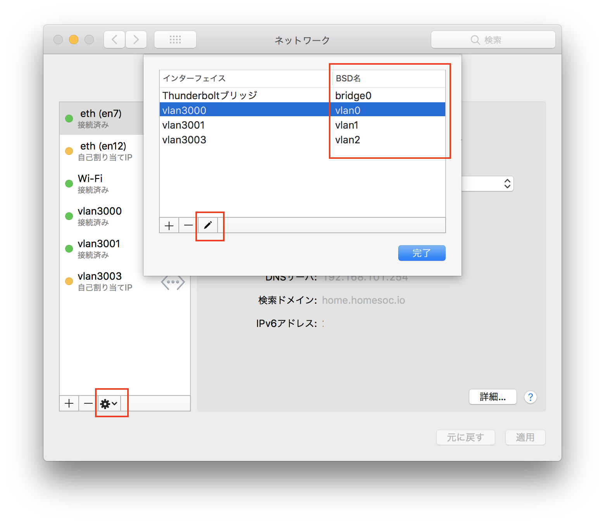
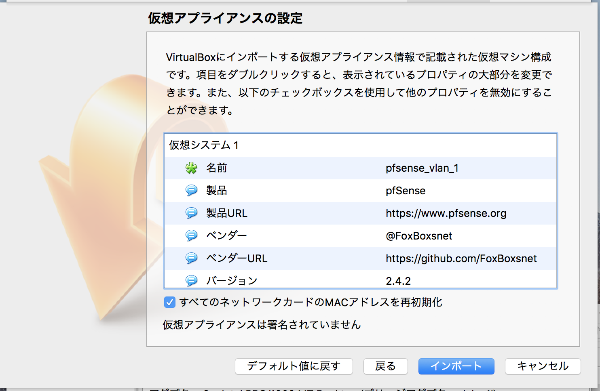
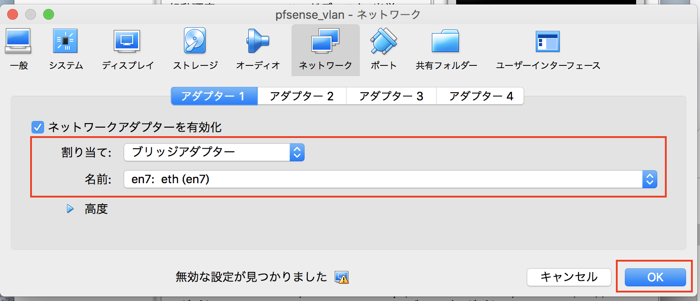

# pfSense packer box
pfSense OVA file creation VirtualBox with Packer

# Download ISO manually
As packer is not able to download gzipped ISO files directly, you have to download
it manually and extract it. Then customize the pfsense-[ single | vlan ].json file so packer could
find the ISO file locally.

http://fleximus.org/mirror/pfsense/downloads

# Create OVA

```
packer build -only=virtualbox-iso pfsense-2.4.2-[ single | vlan ].json
```

## Pakcer Debug

```shell
# Debug for bash etc..
export PACKER_LOG="DEBUG"

# Debug for fish shell
set -x PACKER_LOG DEBUG


# unDebug for bash etc..
export PACKER_LOG=""

# unDebug for fish shell
set -x PACKER_LOG

```


## config.xml
---

* CPU: `2` Core
* Memory: `2048` MB
* DISK Size: `8192` GB
* ssh enable (LAN Network)
* NTP Servers: `ntp.nict.jp`
* Time Zone: `Asia/ToKyo`
* Add package
  * sudo


### OVA information
---

|||
|:-|:-|
| Product     | pfSense                                      |
| Product URL | https://www.pfsense.org                      |
| Version     | 2.4.2                                        |
| Vendor      | @FoxBoxsnet                                  |
| vendor URL  | https://github.com/FoxBoxsnet                |
| Repository  | https://github.com/FoxBoxsnet/packer-pfSense |


### NIC
---

| mode         | VLAN名  | NIC | vlan |
|:-|:-|:-|:-|
| single, vlan |WAN   | em0 | 0    |
| single, vlan |MGMT  | em1 | 3000 |
| vlan | USER | em2 | 3001 |
| ~~vlan~~ |~~NAT64~~ | ~~em3~~ | ~~3003~~ |


#### vlan OVA Setttings
---

##### MacOS Settings
---

1. MacOSの設定を開いて、`歯車マーク` をクリック
1. `仮想インターフェースの管理` をクリック
1. `ペンマーク` をクリック
1. `VLAN名`, `タグ`, `インターフェイス`, を入力.
1. `完了` をクリック
1. `vlan3000`, `vlan3001`, `vlan3003` の分実行する

| VLAN名 | タグ | インターフェイス |
|:-------|:----|:--------------|
| vlan3000 | 3000 | (任意のブリッジインターフェイス) |
| vlan3001 | 3001 | (任意のブリッジインターフェイス) |
| vlan3003 | 3003 | (任意のブリッジインターフェイス) |





画面の `BSD名` をメモすること。


### adduser
---

|||
|:-|:-|
| username  | vagrant |
| password  | vagrant |
| groupname | admins  |


## OVA Inport
---

1. `ファイル` => `仮想アプライアンスのインポート`
1. Build してできた。 ファイルを選択して `続き` をクリック
1. `すべてのネットワークカードのMACアドレスを再初期化` にチェックを **確実** 入れる。
1. `インポート`　をクリック




#### 仮想マシーンの設定変更
---

1. `ネットワーク` の `アダプター1` を選択
1. `割り当て` を `ブリッジアダプター` に変更
1. `名前` を 任意のブリッジインターフェイスに変更(スクリーンショットの場合は `en7`)
1. `OK` をクリック



あとは起動して `https://10.200.10.1` でアクセスすると。 WebUI が見られる


**ユーザー `vagrant` がいるので適宜処理推奨.**
